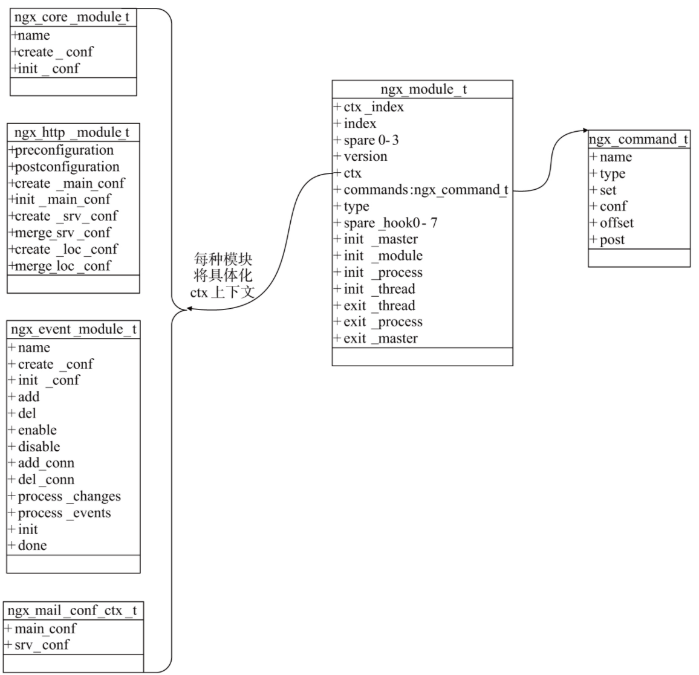
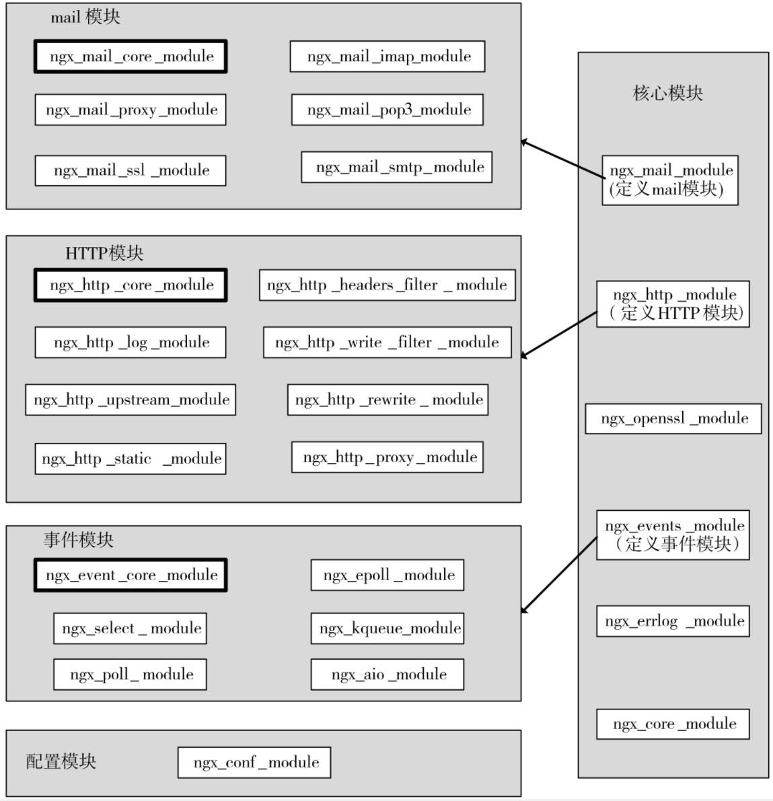

# 核心代码

## `ngx_module_t`结构体

正是`nginx`模块结构体`ngx_module_t`设计简单，以及所有模块都遵循`ngx_module_t`的接口规范，使得`nginx`拥有优秀的模块化设计和灵活性

- `ngx_module_t`模块的实现相应模块方式



- 五大类型的模块（核心模块，配置模块，HTTP模块，Mail模块，事件模块）对`ngx_module_t`的联系



- 源码实现

```c
/* src/core/ngx_module.h */
/* nginx模块接口 */
struct ngx_module_s {
    ngx_uint_t            ctx_index;    // 当先模块在这一类模块的序号
    ngx_uint_t            index;        // 总的模块数组序号

    char                 *name;

    ngx_uint_t            spare0;
    ngx_uint_t            spare1;

    ngx_uint_t            version;
    const char           *signature;

    void                 *ctx;          // 指向这一类模块的公共接口
    ngx_command_t        *commands;     // 处理nginx.conf配置项
    ngx_uint_t            type;         // 模块类型

    /* 七个核心的回调函数 */
    ngx_int_t           (*init_master)(ngx_log_t *log);
    ngx_int_t           (*init_module)(ngx_cycle_t *cycle);
    ngx_int_t           (*init_process)(ngx_cycle_t *cycle);
    ngx_int_t           (*init_thread)(ngx_cycle_t *cycle);
    void                (*exit_thread)(ngx_cycle_t *cycle);
    void                (*exit_process)(ngx_cycle_t *cycle);
    void                (*exit_master)(ngx_cycle_t *cycle);

    uintptr_t             spare_hook0;
    uintptr_t             spare_hook1;
    uintptr_t             spare_hook2;
    uintptr_t             spare_hook3;
    uintptr_t             spare_hook4;
    uintptr_t             spare_hook5;
    uintptr_t             spare_hook6;
    uintptr_t             spare_hook7;
};
```

## `ngx_core_module_t`结构体

`Nginx`还定义了一种基础类型的模块：核心模块，它的模块类型叫做`NGX_CORE_MODULE`
目前官方的核心类型模块中共有6个具体模块:
- ngx_core_module
- ngx_errlog_module
- ngx_events_module
- ngx_openssl_module
- ngx_http_module
- ngx_mail_module

为什么要定义核心模块呢？因为这样可以简化Nginx的设计，使得非模块化的框架代码只关注于如何调用6个核心模块
- 代码
```c
/* nginx核心模块 */
typedef struct {
    ngx_str_t             name;
    void               *(*create_conf)(ngx_cycle_t *cycle);
    char               *(*init_conf)(ngx_cycle_t *cycle, void *conf);
} ngx_core_module_t;
```

## `ngx_cycle_t`结构体

`Nginx`是围绕着`ngx_cycle_t`结构体进行事件循环

- 代码
```c
/* src/core/ngx_cycle.h */
struct ngx_cycle_s {
    void                  ****conf_ctx;         /* 保存所有模块配置项的指针数组 */
    ngx_pool_t               *pool;             /* 内存池 */
    ngx_log_t                *log;              /* 日志 */
    ngx_log_t                 new_log;

    ngx_uint_t                log_use_stderr;   /* unsigned  log_use_stderr:1; */

    ngx_connection_t        **files;            /* 保存文件句柄数组 */
    ngx_connection_t         *free_connections; /* 可用连接池 */
    ngx_uint_t                free_connection_n;/* 连接池总数 */

    ngx_module_t            **modules;          /* 存放各种模块的数组 */
    ngx_uint_t                modules_n;
    ngx_uint_t                modules_used;    /* unsigned  modules_used:1; */

    ngx_queue_t               reusable_connections_queue;/* 可复用连接队列 */
    ngx_uint_t                reusable_connections_n;   /* 队列大小 */
    time_t                    connections_reuse_time;  

    ngx_array_t               listening;        /* 存储监听端口 */
    ngx_array_t               paths;            /* 存储所有需要的文件路径 */

    ngx_array_t               config_dump;
    ngx_rbtree_t              config_dump_rbtree;
    ngx_rbtree_node_t         config_dump_sentinel;

    ngx_list_t                open_files;       /* 打开的所有文件 */
    ngx_list_t                shared_memory;    /* 共享内存 */

    ngx_uint_t                connection_n;     /* 可用连接池总数 */
    ngx_uint_t                files_n;          /* 文件句柄数组总数 */

    ngx_connection_t         *connections;      /* 指向当前进程的所有连接对象 */
    ngx_event_t              *read_events;      /* 指向当前进程的所有读事件 */
    ngx_event_t              *write_events;     /* 指向当前进程的所有写事件 */

    ngx_cycle_t              *old_cycle;        /* init时，需要old_cycle */

    ngx_str_t                 conf_file;        /* 配置文件路径 */
    ngx_str_t                 conf_param;       /* 处理配置文件的参数 */
    ngx_str_t                 conf_prefix;      /* nginx.conf安装路径 */
    ngx_str_t                 prefix;           /* nginx安装路径 */
    ngx_str_t                 error_log;        /* 错误日志 */
    ngx_str_t                 lock_file;        /* 用于同步文件锁 */
    ngx_str_t                 hostname;         /* 主机名 */
};
```

## 代码目录

```shell
.
├── nginx.c
├── nginx.h
├── ngx_array.c
├── ngx_array.h
├── ngx_buf.{c, h}          // 缓冲区结构
├── ngx_conf_file.{c, h}    // 配置文件解析
├── ngx_config.h
├── ngx_connection.{c, h}   // 被动连接相关结构体 
├── ngx_core.h              // 声明各种模块
├── ngx_cpuinfo.c
├── ngx_crc32.c
├── ngx_crc32.h
├── ngx_crc.h
├── ngx_crypt.c
├── ngx_crypt.h
├── ngx_cycle.{c, h}        // 事件循环结构体，Nginx各进程的主要工作流程都是以ngx_cycle_t结构体作为基础的
├── ngx_file.c
├── ngx_file.h
├── ngx_hash.{c, h}         // nginx键值对类型
├── ngx_inet.c
├── ngx_inet.h
├── ngx_list.{c, h}         // nginx链表
├── ngx_log.c
├── ngx_log.h
├── ngx_md5.c
├── ngx_md5.h
├── ngx_module.{c, h}       // nginx模块实现
├── ngx_murmurhash.c
├── ngx_murmurhash.h
├── ngx_open_file_cache.c
├── ngx_open_file_cache.h
├── ngx_output_chain.c
├── ngx_palloc.c
├── ngx_palloc.h
├── ngx_parse.c
├── ngx_parse.h
├── ngx_parse_time.c
├── ngx_parse_time.h
├── ngx_proxy_protocol.c
├── ngx_proxy_protocol.h
├── ngx_queue.c
├── ngx_queue.h
├── ngx_radix_tree.c
├── ngx_radix_tree.h
├── ngx_rbtree.c
├── ngx_rbtree.h
├── ngx_regex.c
├── ngx_regex.h
├── ngx_resolver.c
├── ngx_resolver.h
├── ngx_rwlock.c
├── ngx_rwlock.h
├── ngx_sha1.c
├── ngx_sha1.h
├── ngx_shmtx.c
├── ngx_shmtx.h
├── ngx_slab.c
├── ngx_slab.h
├── ngx_spinlock.c
├── ngx_string.{c, h} // 字符串结构
├── ngx_syslog.c
├── ngx_syslog.h
├── ngx_thread_pool.c
├── ngx_thread_pool.h
├── ngx_times.c
├── ngx_times.h
```