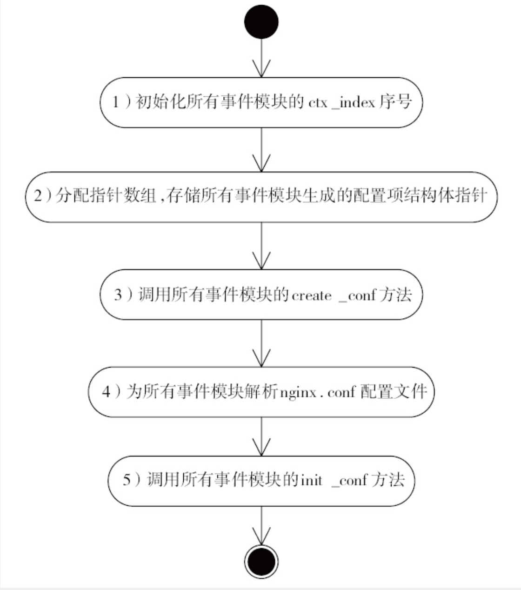
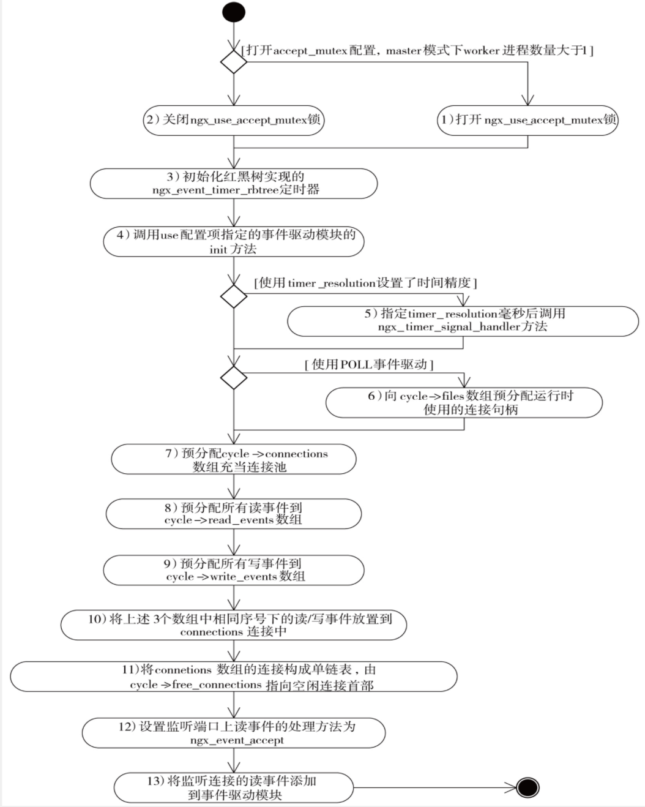
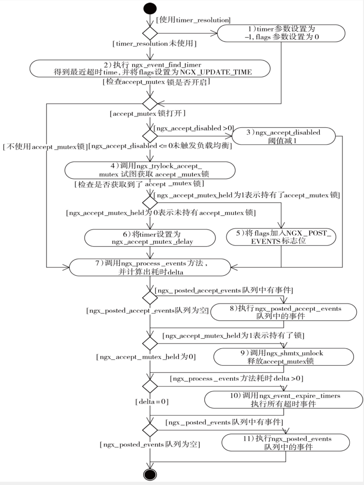

# 事件模块

## 简述

事件模块主要处理事件的收集，处理和分发，同时不同系统处理事件的方式不同，故Nginx为不同操作系统定义了不同的事件驱动模块
- `ngx_epoll_module`
- `ngx_kqueue_module`
- `ngx_poll_module`
- `ngx_select_module`
- `ngx_devpoll_module`
- `ngx_eventport_module`
- `ngx_aio_module`
- `ngx_rtsig_module`
- 基于Windows的`ngx_select_module`模块

初始化时采用`ngx_event_core_module`选择其一


## 事件处理核心模块`ngx_event_module_t`

- 源码

```c
/* src/event/ngx_event.h */
typedef struct {
    ngx_str_t              *name;   

    // 解析，初始化配置项
    void                 *(*create_conf)(ngx_cycle_t *cycle);
    char                 *(*init_conf)(ngx_cycle_t *cycle, void *conf);

    // 实现事件驱动机制所需的10个抽象方法
    // e.g.: 在事件框架添加/删除事件
    ngx_event_actions_t     actions;
} ngx_event_module_t;
```

## 如何构建事件模块 - `ngx_event_module`的实现

这里让我感觉不舒服的一点是`ngx_event_module`的实现是作为核心模块实现事件模块的配置项解析和初始化，反而`ngx_event_core_module`用来管理事件处理分发，这个命名让我甚是混淆

- 先定义好相应的配置项`ngx_command_t`用于解析配置文件解析`events{...}`配置块

```c
/* src/event/ngx_event.c */
static ngx_command_t  ngx_events_commands[] = {

    { ngx_string("events"),
      NGX_MAIN_CONF|NGX_CONF_BLOCK|NGX_CONF_NOARGS,
      ngx_events_block,
      0,
      0,
      NULL }, ngx_null_command
};
```

`ngx_events_block`用于设置事件模块配置项




- 作为核心模块需要实现核心模块的共同接口`ngx_core_module_t`

```c
/* src/event/ngx_event.c */
static ngx_core_module_t  ngx_events_module_ctx = {
    ngx_string("events"),
    NULL,
    ngx_event_init_conf
};
```

- 实现`ngx_event_module`

```c
/* src/event/ngx_event.c */
ngx_module_t  ngx_events_module = {
    NGX_MODULE_V1,
    &ngx_events_module_ctx,                /* module context */
    ngx_events_commands,                   /* module directives */
    NGX_CORE_MODULE,                       /* module type */
    NULL,                                  /* init master */
    NULL,                                  /* init module */
    NULL,                                  /* init process */
    NULL,                                  /* init thread */
    NULL,                                  /* exit thread */
    NULL,                                  /* exit process */
    NULL,                                  /* exit master */
    NGX_MODULE_V1_PADDING
};
```

## `ngx_event_core_module`实现

`ngx_event_core_module`在所有事件模块的第一位执行，用于构建连接池，以及决定使用哪种事件驱动机制，以及初始化需要的哪些事件模型

- 源码

```c
// 命名核心事件模块
static ngx_str_t  event_core_name = ngx_string("event_core");
...
// 实现通用`ngx_event_module_t`接口
static ngx_event_module_t  ngx_event_core_module_ctx = {
    &event_core_name,
    ngx_event_core_create_conf,            /* create configuration */
    ngx_event_core_init_conf,              /* init configuration */

    { NULL, NULL, NULL, NULL, NULL, NULL, NULL, NULL, NULL, NULL }
};
...
// 实现核心事件模块 
ngx_module_t  ngx_event_core_module = {
    NGX_MODULE_V1,
    &ngx_event_core_module_ctx,            /* module context */
    ngx_event_core_commands,               /* module directives */
    NGX_EVENT_MODULE,                      /* module type */
    NULL,                                  /* init master */
    ngx_event_module_init,                 /* init module */
    ngx_event_process_init,                /* init process */
    NULL,                                  /* init thread */
    NULL,                                  /* exit thread */
    NULL,                                  /* exit process */
    NULL,                                  /* exit master */
    NGX_MODULE_V1_PADDING
};
```

在Nginx启动过程中还没有fork出worker子进程时，会首先调用ngx_event_core_module模块的ngx_event_module_init方法，而在fork出worker子进程后，每一个worker进程会在调用ngx_event_core_module模块的ngx_event_process_init方法后才会进入正式的工作循环

- `ngx_event_module_init`工作

初始化了一些变量，尤其是ngx_http_stub_status_module统计模块使用的一些原子性的统计变量等等

- `ngx_event_process_init`工作




## `ngx_process_events_and_timers`流程

每个`worker`进程调用`ngx_process_events_and_timers`进行对所有事件的处理

- 源码

[src/event/ngx_event.c](ngx_event.c#L200)

- 函数流程图



## `Nginx`事件结构体 - `ngx_event_t`

`Nginx`事件都由`ngx_event_t`表示，其中较为重要的部分是其`hander`属性

- 源码

[src/event/ngx_event.h](ngx_event.h#L30)

## 被动连接`ngx_connection_t`

被动连接在`nginx`中指得是客户端向服务器发起的连接，服务器被动接受

- 源码

[src/core/ngx_connection.h](../core/ngx_connection.h#L125)

## 主动连接`ngx_peer_connection_t`

主动连接指`Nginx`主动向其他服务器发起连接

- 源码

[src/event/ngx_event_connection.h](ngx_event_connect.h#L38)

## `ngx_event_pipe_t`结构体

打开缓存转发响应的关键

- 源码

[src/event/ngx_event_pipe.h](ngx_event_pipe.h#L27)

## 代码结构

```shell
event
│  ngx_event.{c, h}             // 事件模块核心结构体实现
│  ngx_event_accept.c
│  ngx_event_acceptex.c
│  ngx_event_connect.{c, h}     // nginx主动连接结构体实现
│  ngx_event_connectex.c
│  ngx_event_openssl.c
│  ngx_event_openssl.h
│  ngx_event_openssl_stapling.c
│  ngx_event_pipe.c
│  ngx_event_pipe.h
│  ngx_event_posted.c
│  ngx_event_posted.h
│  ngx_event_timer.{c, h}       // 定时器相关
│  ngx_event_udp.c
│  Readme.md
│
└─modules       // 不同系统对应的事件处理模块
        ngx_devpoll_module.c
        ngx_epoll_module.c      // epoll，异步I/O
        ngx_eventport_module.c
        ngx_iocp_module.c
        ngx_iocp_module.h
        ngx_kqueue_module.c
        ngx_poll_module.c
        ngx_select_module.c
        ngx_win32_poll_module.c
        ngx_win32_select_module.c
```