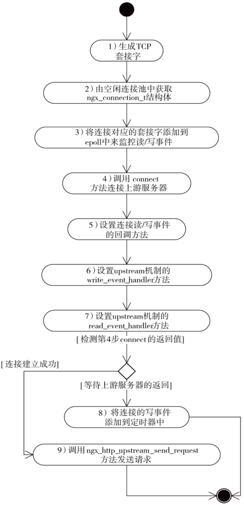

# HTTP模块

## `ngx_http_module_t`模块

HTTP核心模块，负责配置文件解析

- 源码

```c++
/* src/http/ngx_http_config.h */
typedef struct {
    /* 解析http{...}前回调 */
    ngx_int_t   (*preconfiguration)(ngx_conf_t *cf);
    /* 解析http{...}后回调 */
    ngx_int_t   (*postconfiguration)(ngx_conf_t *cf);

    /* 创建用于存储HTTP全局配置项的结构体 */
    void       *(*create_main_conf)(ngx_conf_t *cf);
    /* 解析完http{...}配置项后回调 */
    char       *(*init_main_conf)(ngx_conf_t *cf, void *conf);

    /* 创建用于存储可同时出现在http{...}、server{...}级别配置项的结构体 */
    void       *(*create_srv_conf)(ngx_conf_t *cf);
    /* 出现在http{...}级别中的配置项值合并到server{...}级别配置项中 */
    char       *(*merge_srv_conf)(ngx_conf_t *cf, void *prev, void *conf);

    /*创建用于存储可同时出现在http{...}、server{...}、location{...}级别配置项的结构体  */
    void       *(*create_loc_conf)(ngx_conf_t *cf);
    /* 出现在http{...}、server{...}级别中的配置项值合并到location{...}级别配置项中 */
    char       *(*merge_loc_conf)(ngx_conf_t *cf, void *prev, void *conf);
} ngx_http_module_t;
```

## `ngx_http_request_t`结构体

负责封装HTTP请求报文

```c
/* src/http/ngx_http_request.h */
struct ngx_http_request_s {
    uint32_t                          signature;        /* "HTTP" */
    ngx_connection_t                 *connection;       /* 对应客户端链接 */
    void                            **ctx;              /* 保存所有HTTP上下文模块指针数组 */
    void                            **main_conf;        /* 指针数组：http配置项 */
    void                            **srv_conf;         /* 指针数组：server配置项 */
    void                            **loc_conf;         /* 指针数组：location配置项 */

    ngx_http_event_handler_pt         read_event_handler;   /* 读事件回调函数 */
    ngx_http_event_handler_pt         write_event_handler;  /* 写事件回调函数 */
...
    ngx_http_upstream_t              *upstream;         /* upstream相关 */
...
    ngx_pool_t                       *pool;             /* 内存池 */
    ngx_buf_t                        *header_in;        /* 接受HTTP头部缓冲区 */

    ngx_http_headers_in_t             headers_in;       /* HTTP头部链表 */
    ngx_http_headers_out_t            headers_out;      /* HTTP响应链表 */

    ngx_http_request_body_t          *request_body;     /* HTTP包体 */
    time_t                            lingering_time;   /* 延迟关闭事件 */
    time_t                            start_sec;        /* 当前请求初始化事件 */
    ngx_msec_t                        start_msec;       /* 毫秒偏移量 */
    
    /* 解析HTTP头部保存的信息 */
    ngx_uint_t                        method;
    ngx_uint_t                        http_version;
    ngx_str_t                         request_line;
    ngx_str_t                         uri;
    ngx_str_t                         args;
    ngx_str_t                         exten;
    ngx_str_t                         unparsed_uri;
    ngx_str_t                         method_name;
    ngx_str_t                         http_protocol;
    ngx_str_t                         schema;

    ngx_chain_t                      *out;              /* HTTP响应 */
    ngx_http_request_t               *main;             /* 用于判断是否为原始请求 */
    ngx_http_request_t               *parent;           /* 当前请求的父请求 */
    
    /* 子请求相关 */
    ngx_http_postponed_request_t     *postponed;        
    ngx_http_post_subrequest_t       *post_subrequest;
    ngx_http_posted_request_t        *posted_requests;

    ngx_int_t                         phase_handler;    /* 阶段回调函数 */
    ngx_http_handler_pt               content_handler;  /* content阶段回调函数 */
    ngx_uint_t                        access_code;      /* acess阶段判断是否有请求权限 */
...
    off_t                             request_length;   /* HTTP请求行长度 */
...
    ngx_http_cleanup_t               *cleanup;          /* 销毁请求时回调函数 */

    /* 标志位 */
    unsigned                          count:16;         /* 调用次数 */
    unsigned                          subrequests:8;    /* 子请求数 */
    unsigned                          blocked:8;        /* 是否阻塞 */
    unsigned                          aio:1;            /* 是否使用异步文件I/O */
    unsigned                          http_state:4;     /* HTTP状态集状
...
    unsigned                          keepalive:1;      /* keepalive标志 */
...
    unsigned                          buffered:4;       /* 是否缓冲区有待发送内容 */
...
};
```

## HTTP请求处理11个阶段

- 状态定义

```c
/* /src/http/ngx_http_core_module.h */
/* HTTP请求处理的十一个阶段 */
typedef enum {
    NGX_HTTP_POST_READ_PHASE = 0,   /* 读取请求内容阶段 */
    NGX_HTTP_SERVER_REWRITE_PHASE,  /* Server请求地址重写阶段 *//
    NGX_HTTP_FIND_CONFIG_PHASE,     /* 配置查找阶段 */
    NGX_HTTP_REWRITE_PHASE,         /* Location请求地址重写阶段 */
    NGX_HTTP_POST_REWRITE_PHASE,    /* 请求地址重写提交阶段*/
    NGX_HTTP_PREACCESS_PHASE,       /* 访问权限检查准备阶段 */
    NGX_HTTP_ACCESS_PHASE,          /* 访问权限检查阶段 */
    NGX_HTTP_POST_ACCESS_PHASE,     /* 访问权限检查提交阶段 */
    NGX_HTTP_PRECONTENT_PHASE,      /* 配置项 try_files 处理阶段 */
    NGX_HTTP_CONTENT_PHASE,         /* 内容产生阶段 */
    NGX_HTTP_LOG_PHASE              /* 日志模块处理阶段 */
} ngx_http_phases;
```

## HTTP框架初始化阶段


## HTTP框架执行流程

1. 收到TCP连接，调用`ngx_http_init_connection`[函数](ngx_http_request.c#L207)设置可读/可写事件的回调函数，事件发生调用相应的回调函数
2. TCP连接上第一次出现可读事件时（当缓冲区上有字节可读时），调用`ngx_http_wait_request_handler`[函数](ngx_http_request.c#L375)初始化HTTP请求


3. 初始化`http_request_t`初始化完成后，开始接收HTTP请求行，调用`ngx_http_process_request_line`[函数](ngx_http_request.c#L1053)接收HTTP请求行


4. 若HTTP请求行接收完成，调用`ngx_http_process_request_headers`[函数](ngx_http_request.c#L1338)接收HTTP头部


5. 若完成HTTP头部接收，调用`ngx_http_process_request`[函数](ngx_http_request.c#L2010)开始处理解析HTTP请求


6. 调用`ngx_http_read_client_request_body`[函数](ngx_http_request_body.c#L31)接收HTTP包体，调用`ngx_http_discard_request_body`[函数](ngx_http_request_body.c#L569)丢弃包体

7. 发送HTTP响应，调用`ngx_http_send_header`[函数]构造响应行和头部(ngx_http_core_module.c#L1813)和`ngx_http_output_filter`[函数](ngx_http_core_module.c#L1835)发送响应包体

8. 调用`ngx_http_free_request`[函数](ngx_http_request.c#L3623)释放相应数据结构，调用`ngx_http_close_connection`[函数](ngx_http_request.c#L3731)关闭TCP连接，结束HTTP请求

总体流程


## `ngx_http_upstream_s`结构体：
- 源码

[src/http/ngx_http_upstream.h](ngx_http_upstream.h#L320)

## `ngx_http_upstream_conf_t`结构体

- 源码
  
[src/http/ngx_http_upstream.h](ngx_http_upstream.h#L149)

## upstream模块

- 访问upstream阶段

1. 启动upstream机制


2. 和上游服务器建立连接



3. 发送请求给上游服务器


4. 接收上有服务器的响应，调用`ngx_http_upstream_process_header`


处理包体的三种方式
- 不转发响应，调用`ngx_http_upstream_process_body_in_memory`函数
- 转发响应应该以下游网速优先
- 转发响应应该以上游网速优先

5. 结束upstream请求

## 代码目录

```shell
.
├── modules
├── ngx_http.c
├── ngx_http_cache.h
├── ngx_http_config.h            // http核心模块
├── ngx_http_copy_filter_module.c
├── ngx_http_core_module.{c, h}  // 存储http{...}, server{...}, location{...} 配置项
├── ngx_http_file_cache.c
├── ngx_http.h
├── ngx_http_header_filter_module.c
├── ngx_http_parse.c
├── ngx_http_postpone_filter_module.c
├── ngx_http_request_body.c
├── ngx_http_request.{c, h}         // 处理http请求报文
├── ngx_http_script.c
├── ngx_http_script.h
├── ngx_http_special_response.c
├── ngx_http_upstream.{c, h}        // upstream模块
├── ngx_http_upstream_round_robin.c
├── ngx_http_upstream_round_robin.h
├── ngx_http_variables.c
├── ngx_http_variables.h
├── ngx_http_write_filter_module.c
└── v2
```