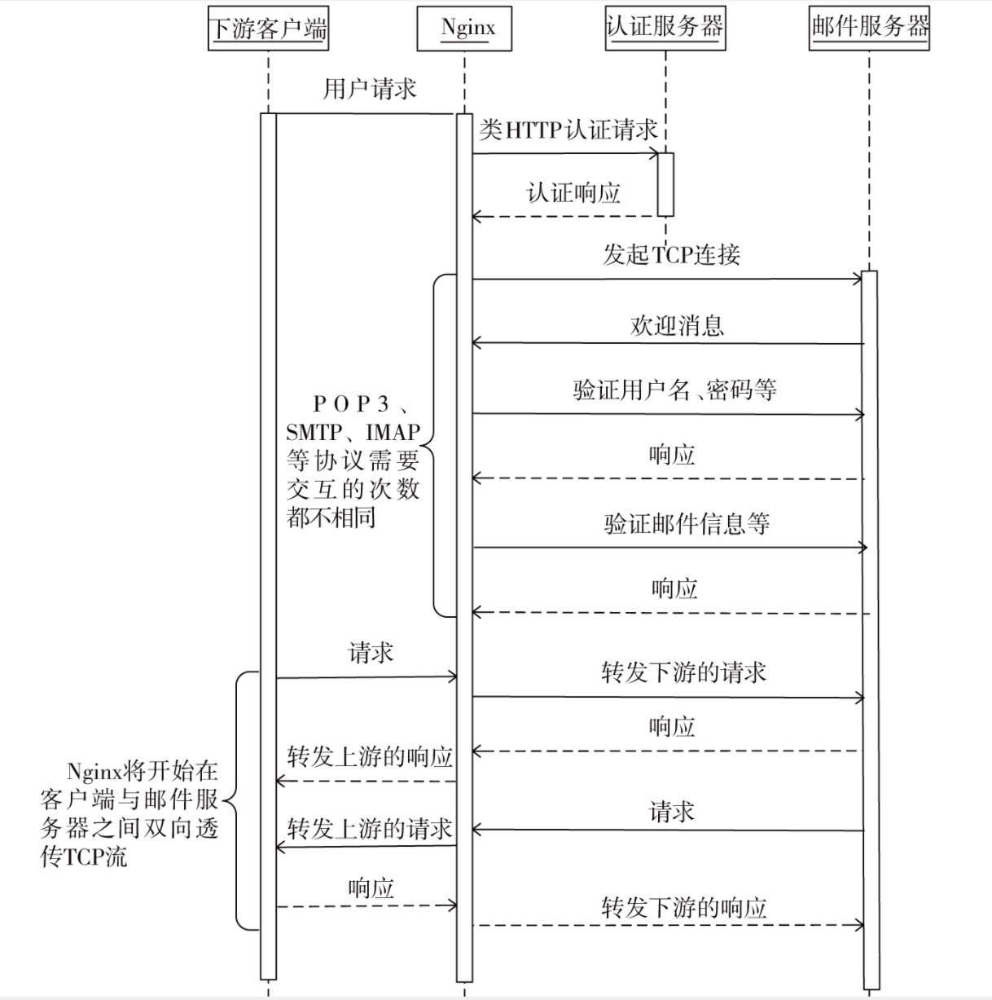

# 邮件代理模块

Nginx可以构建支持POP3/SMTP/IMAP协议的邮件代理服务

## 基本流程

1. 初始化邮件请求

当客户端发起的TCP连接建立成功时，就会回调邮件框架初始化时设定的`ngx_mail_init_connection`方法，在这个方法中会初始化将要用到的数据结构，并设置下一个阶段的处理方法。

2. 接收解析客户端请求

接收、解析客户端的请求。这个阶段会读取客户端发来的TCP流，并使用状态机解析它，如果解析后发现已接收到完整的请求，则进入下一阶段；否则，将会继续把连接上的读事件添加到epoll中，并等待epoll的下一次调度，以便继续读取客户端请求

3. 向认证服务器发起TCP连接

解析到完整的请求后，就需要向认证服务器发起类似HTTP的请求来验证请求是否合法

4. 向认证服务器发送请求阶段

当Nginx与认证服务器成功建立TCP连接时，`ngx_mail_auth_http_module`模块将会构造、发送请求到认证服务器。`ngx_mail_auth_http_write_handler`方法会确保全部的请求都发送到认证服务器中

5. 接收并解析认证服务器响应

Nginx接收认证服务器的响应是通过`ngx_mail_auth_http_read_handler`完成的，在该方法中，每接收一部分响应都要使用状态机来解析，在接收完整的响应（包括响应行和HTTP头部）后，还会分析响应结果以确定请求是否合法，如果合法，将继续执行下一阶段

6. 向上游服务器发起连接

这一阶段将从认证服务器返回的响应中获得上游邮件服务器的地址，接着向上游邮件服务器发起TCP连接

7. 与邮件服务器交互

在TCP连接建立成功后，接下来是Nginx与邮件服务器使用POP3、SMTP或者IMAP交互的阶段。这一过程主要是Nginx将请求中的用户、密码、发件人、收件人等信息传递给邮件服务器，这个过程是双向的，直到Nginx认为邮件服务器同意继续向下进行时，才会继续下一阶段。

8. 双向透传下游客户端与上游邮件服务器

这一阶段是最主要的透传邮件协议阶段。只要Nginx收到下游客户端的TCP流（无论是哪一种邮件协议），会原封不动地转发给上游的邮件服务器，同样，如果收到上游的TCP流，也会原样转发给下游



## `ngx_mail_module_t`结构体

mail模块的`ngx_module_t`接口实现

- 源码

```c
typedef struct {
    /* 协议类型 */
    ngx_mail_protocol_t        *protocol;       

    void                       *(*create_main_conf)(ngx_conf_t *cf);
    char                       *(*init_main_conf)(ngx_conf_t *cf, void *conf);

    void                       *(*create_srv_conf)(ngx_conf_t *cf);
    char                       *(*merge_srv_conf)(ngx_conf_t *cf, void *prev,
                                                  void *conf);
} ngx_mail_module_t;
```

## `ngx_mail_session_t`结构体

类似HTTP模块中的核心结构体`ngx_http_request_t`

- 源码

```c
/* 描述邮件请求 */
typedef struct {
    uint32_t                signature;      /* "MAIL" */

    ngx_connection_t       *connection;     /* 下游客户端 */

    ngx_str_t               out;            /* 向下游发送内容 */
    ngx_buf_t              *buffer;         /* 接收下游请求的缓冲区 */

    void                  **ctx;            /* 邮件模块上下文、用于添加不同种协议 */
    void                  **main_conf;      /* main级别配置项指针数组 */
    void                  **srv_conf;       /* srv级别配置项指针数组 */

    ngx_resolver_ctx_t     *resolver_ctx;   /* 解析主机域名 */

    ngx_mail_proxy_ctx_t   *proxy;          /*  */

    ngx_uint_t              mail_state;     /* 邮件协议状态机状态 */

    unsigned                protocol:3;     /* 协议类型 */
    unsigned                blocked:1;      /* 是否读/写操作阻塞 */
    unsigned                quit:1;         /* 是否请求结束 */
    unsigned                quoted:1;       
    unsigned                backslash:1;
    unsigned                no_sync_literal:1;
    unsigned                starttls:1;     /* 是否使用TLS */
    unsigned                esmtp:1;
    unsigned                auth_method:3;  /* 认证服务器交互记录 */
    unsigned                auth_wait:1;    

    /* 用于验证的用户和密码 */
    ngx_str_t               login;          
    ngx_str_t               passwd;

    ngx_str_t               salt;
    ngx_str_t               tag;
    ngx_str_t               tagged_line;
    ngx_str_t               text;

    ngx_str_t              *addr_text;      /* Nginx服务器地址 */
    ngx_str_t               host;           /* 主机地址 */
    ngx_str_t               smtp_helo;
    ngx_str_t               smtp_from;
    ngx_str_t               smtp_to;

    ngx_str_t               cmd;

    ngx_uint_t              command;
    ngx_array_t             args;

    ngx_uint_t              login_attempt;  /* 认证服务器交互次数 */

    /* 用来解析 POP3/IMAP/SMTP 命令 */
    ngx_uint_t              state;
    u_char                 *cmd_start;
    u_char                 *arg_start;
    u_char                 *arg_end;
    ngx_uint_t              literal_len;
} ngx_mail_session_t;
```

## 代码目录

```shell
├── ngx_mail.{c, h}     // 邮件协议核心代码
├── ngx_mail_auth_http_module.c 
├── ngx_mail_core_module.c
├── ngx_mail_handler.c
├── ngx_mail_parse.c        
├── ngx_mail_proxy_module.c // 代理模块
├── ngx_mail_imap_handler.c // IMAP协议相关
├── ngx_mail_imap_module.c
├── ngx_mail_imap_module.h
├── ngx_mail_pop3_handler.c // POP3协议相关
├── ngx_mail_pop3_module.c
├── ngx_mail_pop3_module.h
├── ngx_mail_smtp_handler.c // SMTP协议相关
├── ngx_mail_smtp_module.c
├── ngx_mail_smtp_module.h
├── ngx_mail_ssl_module.c
└── ngx_mail_ssl_module.h
```